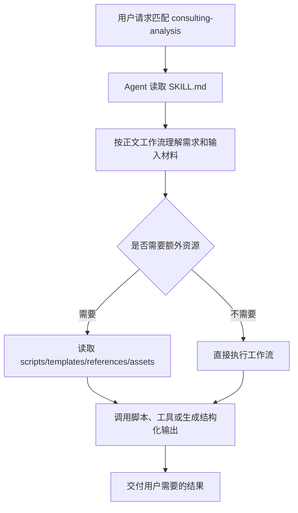

# consulting-analysis Skill（中文可替换运行版）

## 中文执行摘要

采用两阶段咨询报告流程：先搭建章节框架、数据问题和分析逻辑，再基于外部收集的数据生成含图表和洞察的最终报告。

## 替换运行标准

- 此文件用于中文维护；如果未来需要替换原 `SKILL.md`，必须保持本文件开头的 frontmatter 为第一个 YAML frontmatter。
- 不要翻译或改写脚本路径、命令参数、工具名、环境变量、模板路径、输出路径和结构化字段名。
- 正文说明必须直接承载运行语义，不能依赖英文原文兜底。

## 原理和运行流程

`consulting-analysis` 的核心原理：采用两阶段咨询报告流程：先搭建章节框架、数据问题和分析逻辑，再基于外部收集的数据生成含图表和洞察的最终报告。

## 目录角色

- `SKILL.md`：运行时入口说明，frontmatter 决定 skill 名称、触发描述和可能的工具/兼容性元数据，正文定义 Agent 的执行工作流。
- `desc/SKILL_zh.md`：中文可替换运行版；保留运行关键字面量，用于中文维护和审阅。
- 该 skill 当前没有额外脚本、模板或参考文件，主要依赖 `SKILL.md` 中的模型执行流程。

## 运行链路

## 可替换性要求

- `desc/SKILL_zh.md` 的首个 frontmatter 必须保留原 `name`，并保留原有 `allowed-tools`、`metadata`、`compatibility`、`license` 等元数据。
- 命令、脚本路径、模板路径、工具名、环境变量和输出路径必须保持字面量不变。
- 中文正文必须直接承载运行语义；如需扩展，应继续用中文补齐 workflow、资源和输出要求。

## 测试覆盖

当前未发现以该 skill 名称直接命名的专项测试。文档正确性以 `SKILL.md`、资源文件和仓库通用 skill 机制为准。
