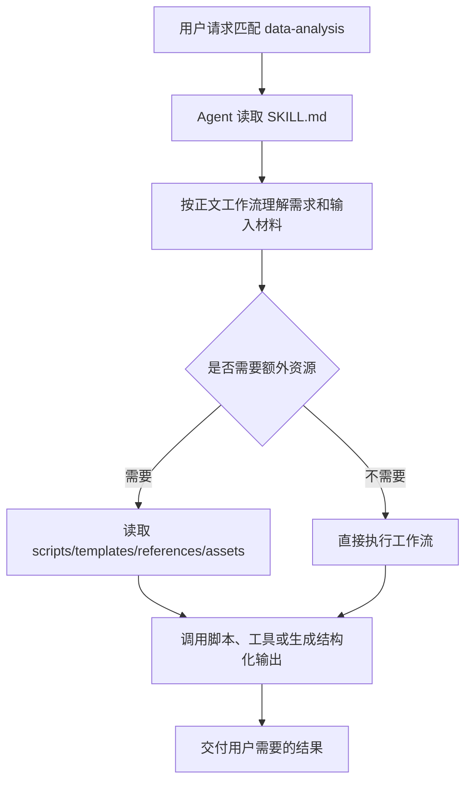

# data-analysis Skill 原理说明

`data-analysis` 的核心原理：把 Excel/CSV 输入交给 Python 分析脚本完成清洗、探索、聚合和导出，再用 Markdown/CSV/JSON 等形式交付结果。

## 目录角色

- `SKILL.md`：运行时入口说明，frontmatter 决定 skill 名称、触发描述和可能的工具/兼容性元数据，正文定义 Agent 的执行工作流。
- `desc/SKILL_zh.md`：中文可替换运行版；保留运行关键字面量和原始执行规范，用于中文维护和审阅。
- 其它资源：
  - `scripts/analyze.py`

## 运行链路

## 可替换性要求

- `desc/SKILL_zh.md` 的首个 frontmatter 必须保留原 `name`，并保留原有 `allowed-tools`、`metadata`、`compatibility`、`license` 等元数据。
- 命令、脚本路径、模板路径、工具名、环境变量和输出路径必须保持字面量不变。
- 为避免复杂运行规范因翻译遗漏而失真，中文文件中保留了原始 `SKILL.md` 正文作为执行权威。

## 测试覆盖

当前未发现以该 skill 名称直接命名的专项测试。文档正确性以 `SKILL.md`、资源文件和仓库通用 skill 机制为准。
