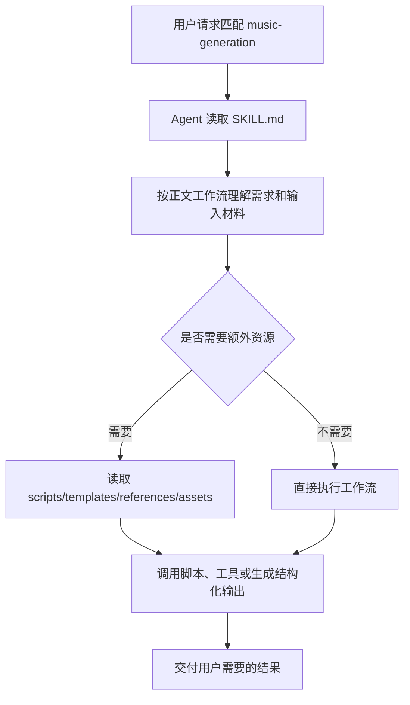

# music-generation Skill（中文可替换运行版）

## 中文执行摘要

Agent 生成音乐 JSON prompt，Python 脚本调用 MiniMax music_generation，把返回音频解码并写出 mp3。

## 替换运行标准

- 此文件用于中文维护；如果未来需要替换原 `SKILL.md`，必须保持本文件开头的 frontmatter 为第一个 YAML frontmatter。
- 不要翻译或改写脚本路径、命令参数、工具名、环境变量、模板路径、输出路径和结构化字段名。
- 正文说明必须直接承载运行语义，不能依赖英文原文兜底。

## 关键资源

- `scripts/generate.py`

## 源码对齐备注

注意：该 skill 只走 MiniMax 音乐接口，需要 `MINIMAX_API_KEY`。

## 原理和运行流程

`music-generation` 的核心原理：Agent 生成音乐 JSON prompt，Python 脚本调用 MiniMax music_generation，把返回音频解码并写出 mp3。

## 目录角色

- `SKILL.md`：运行时入口说明，frontmatter 决定 skill 名称、触发描述和可能的工具/兼容性元数据，正文定义 Agent 的执行工作流。
- `desc/SKILL_zh.md`：中文可替换运行版；保留运行关键字面量，用于中文维护和审阅。
- 其它资源：
  - `scripts/generate.py`

## 运行链路

## 可替换性要求

- `desc/SKILL_zh.md` 的首个 frontmatter 必须保留原 `name`，并保留原有 `allowed-tools`、`metadata`、`compatibility`、`license` 等元数据。
- 命令、脚本路径、模板路径、工具名、环境变量和输出路径必须保持字面量不变。
- 中文正文必须直接承载运行语义；如需扩展，应继续用中文补齐 workflow、资源和输出要求。

## 源码对齐备注

注意：该 skill 只走 MiniMax 音乐接口，需要 `MINIMAX_API_KEY`。

## 测试覆盖

当前仓库中可见的相关测试：
- `tests/skills/test_music_generation.py`
这些测试通常验证脚本/解析/边界逻辑；若 skill 调用第三方服务，mock 测试不等于真实端到端成功。
