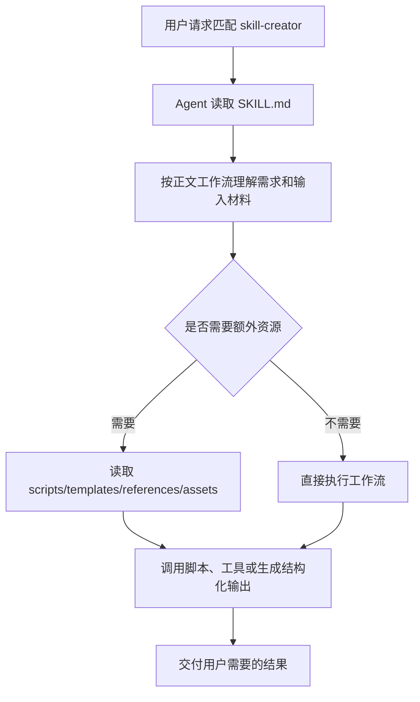

# skill-creator Skill（中文可替换运行版）

## 中文执行摘要

把 skill 创建、修改、评测和优化拆成可执行工作流，并通过专用脚本和参考规范保证包结构与效果。

## 替换运行标准

- 此文件用于中文维护；如果未来需要替换原 `SKILL.md`，必须保持本文件开头的 frontmatter 为第一个 YAML frontmatter。
- 不要翻译或改写脚本路径、命令参数、工具名、环境变量、模板路径、输出路径和结构化字段名。
- 正文说明必须直接承载运行语义，不能依赖英文原文兜底。

## 关键资源

- `LICENSE.txt`
- `agents/analyzer.md`
- `agents/comparator.md`
- `agents/grader.md`
- `assets/eval_review.html`
- `eval-viewer/generate_review.py`
- `eval-viewer/viewer.html`
- `references/output-patterns.md`
- `references/schemas.md`
- `references/workflows.md`
- `scripts/aggregate_benchmark.py`
- `scripts/generate_report.py`
- `scripts/improve_description.py`
- `scripts/init_skill.py`
- `scripts/package_skill.py`
- `scripts/quick_validate.py`
- `scripts/run_eval.py`
- `scripts/run_loop.py`
- `scripts/utils.py`

## 原理和运行流程

`skill-creator` 的核心原理：把 skill 创建、修改、评测和优化拆成可执行工作流，并通过专用脚本和参考规范保证包结构与效果。

## 目录角色

- `SKILL.md`：运行时入口说明，frontmatter 决定 skill 名称、触发描述和可能的工具/兼容性元数据，正文定义 Agent 的执行工作流。
- `desc/SKILL_zh.md`：中文可替换运行版；保留运行关键字面量，用于中文维护和审阅。
- 其它资源：
  - `LICENSE.txt`
  - `agents/analyzer.md`
  - `agents/comparator.md`
  - `agents/grader.md`
  - `assets/eval_review.html`
  - `eval-viewer/generate_review.py`
  - `eval-viewer/viewer.html`
  - `references/output-patterns.md`
  - `references/schemas.md`
  - `references/workflows.md`
  - `scripts/aggregate_benchmark.py`
  - `scripts/generate_report.py`
  - `scripts/improve_description.py`
  - `scripts/init_skill.py`
  - `scripts/package_skill.py`
  - `scripts/quick_validate.py`
  - `scripts/run_eval.py`
  - `scripts/run_loop.py`
  - `scripts/utils.py`

## 运行链路

## 可替换性要求

- `desc/SKILL_zh.md` 的首个 frontmatter 必须保留原 `name`，并保留原有 `allowed-tools`、`metadata`、`compatibility`、`license` 等元数据。
- 命令、脚本路径、模板路径、工具名、环境变量和输出路径必须保持字面量不变。
- 中文正文必须直接承载运行语义；如需扩展，应继续用中文补齐 workflow、资源和输出要求。

## 测试覆盖

当前未发现以该 skill 名称直接命名的专项测试。文档正确性以 `SKILL.md`、资源文件和仓库通用 skill 机制为准。
