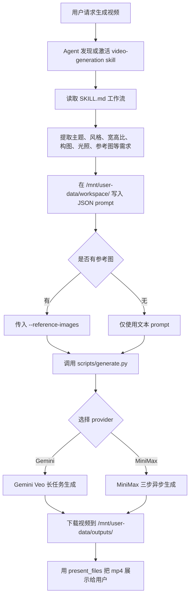

# video-generation Skill 原理说明

`video-generation` 不是 DeerFlow 内部自研的视频模型，而是一个“Agent 工作流说明 + Python 外部生成适配器”的 skill 包。`SKILL.md` 负责告诉 Agent 如何理解视频需求、组织结构化提示词、准备可选参考图和调用脚本；`scripts/generate.py` 负责根据环境变量选择 Gemini Veo 或 MiniMax，向第三方生成接口发起请求、轮询异步任务并把 mp4 下载到输出目录。

## 目录角色

- `SKILL.md`：运行时入口说明。它的 frontmatter 声明 `name: video-generation` 和触发描述，正文定义 Agent 应遵循的工作流。
- `desc/SKILL_zh.md`：`SKILL.md` 的中文可替换说明版本，用于中文维护和审阅。
- `scripts/generate.py`：真正执行视频生成的 CLI 脚本，内部只依赖 `requests`、环境变量和传入的 prompt/reference/output 参数。

## 运行链路



## Agent 编排层

Agent 不直接拼接 API 请求体，而是先按 `SKILL.md` 的工作流把用户需求转成结构化 JSON prompt。这个 prompt 应放在 `/mnt/user-data/workspace/`，例如：

```bash
python /mnt/skills/public/video-generation/scripts/generate.py \
  --prompt-file /mnt/user-data/workspace/prompt-file.json \
  --reference-images /path/to/ref1.jpg \
  --output-file /mnt/user-data/outputs/generated-video.mp4 \
  --aspect-ratio 16:9
```

`SKILL.md` 明确要求提示词始终使用英文。生成结束后，视频产物应保存到 `/mnt/user-data/outputs/`，并通过 `present_files` 展示给用户。

## 脚本执行层

`generate.py` 的 CLI 参数保持稳定：

- `--prompt-file`：读取 JSON prompt 文件，脚本会把整个文件内容作为 provider prompt。
- `--reference-images`：可选参考图路径列表。
- `--output-file`：最终 mp4 写出路径。
- `--aspect-ratio`：CLI 兼容参数；当前脚本不会把它写入任何 provider 请求体。MiniMax 路径明确忽略它，因为 MiniMax 视频接口使用 resolution/duration；Gemini 路径当前也只是保留该参数签名。

脚本入口是 `generate_video(prompt_file, reference_images, output_file, aspect_ratio="16:9")`。它先读取 prompt 文件，再调用 `_resolve_provider()` 决定走哪个 provider。

## Provider 选择规则

当前选择顺序是：

1. 如果设置了 `VIDEO_GENERATION_PROVIDER`，优先使用它的值，支持 `gemini` / `google` / `minimax`。
2. 否则如果存在 `GEMINI_API_KEY`，默认走 Gemini Veo，保持旧行为兼容。
3. 否则如果存在 `MINIMAX_API_KEY`，走 MiniMax。
4. 如果没有强制 provider，且两套凭证都不存在，抛出清晰错误，提示配置 `GEMINI_API_KEY` 或 `MINIMAX_API_KEY`。

这意味着：老用户已有 Gemini 配置时行为不变；只配置 MiniMax 时自动使用 MiniMax；两者都配置但想指定 MiniMax 时，用 `VIDEO_GENERATION_PROVIDER=minimax` 强制。

## Gemini 路径

Gemini 路径调用 `veo-3.1-generate-preview:predictLongRunning`。脚本会：

1. 把 prompt 放入 `instances[0].prompt`。
2. 将所有参考图读取为 base64，放入 `referenceImages`。
3. 发起 long-running operation。
4. 每 3 秒轮询 operation。
5. 完成后取 `generatedSamples[0].video.uri`，再带 `GEMINI_API_KEY` 下载 mp4。

## MiniMax 路径

MiniMax 路径是异步三步：

1. `POST /v1/video_generation`，请求体包含 `model`、`prompt`，以及可选的 `first_frame_image`。
2. `GET /v1/query/video_generation?task_id=<id>` 轮询状态；`Success` 时得到 `file_id`，`Fail` 或超时会报错。
3. `GET /v1/files/retrieve?file_id=<id>` 获取 `download_url`，再下载 mp4。

MiniMax 的默认 host 是 `https://api.minimaxi.com`，可用 `MINIMAX_API_HOST` 覆盖；默认模型是 `MiniMax-Hailuo-2.3`，可用 `MINIMAX_VIDEO_MODEL` 覆盖。

## 参考图处理

参考图在两个 provider 中语义不同：

- Gemini：所有传入参考图都会转成 base64，作为 `referenceImages` 传给 Veo。
- MiniMax：只使用第一张参考图，转成 Data URL 后作为 `first_frame_image`。

因此这个 skill 的图像能力更准确地说是“参考图/首帧引导视频生成”，不是 DeerFlow 自己做图像转视频、帧插值或本地渲染。

## 输出和展示

脚本会确保 `--output-file` 的父目录存在，然后把下载到的视频二进制写入该路径。按照 skill 约定，最终视频应放在 `/mnt/user-data/outputs/` 下，Agent 再用 `present_files` 把文件展示给用户。

## 测试覆盖

当前测试在 `tests/skills/test_video_generation.py`，主要覆盖：

- provider 自动选择、显式覆盖和未知 provider 报错；
- MiniMax 完整三步流转；
- MiniMax 首张参考图转 `first_frame_image`；
- MiniMax `Fail` 状态和轮询超时；
- Gemini 下载和请求失败时的异常；
- 嵌套输出目录自动创建。

这些测试使用 mock，不打真实第三方 API；它们验证的是脚本请求构造、路由、错误处理和文件写出逻辑，不代表真实视频生成端到端成功。
